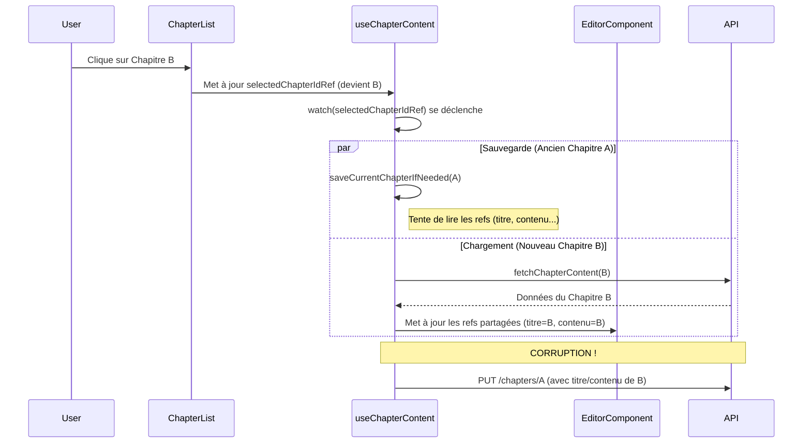
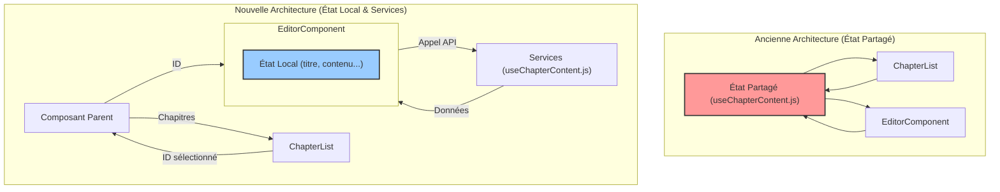

# Plan de Refonte : Le Modèle "Sas de Données" (Data Airlock)

**Date :** 10/06/2025

**Objectif :** Éradiquer le bug critique de corruption de données en refondant la gestion de l'état du contenu des chapitres.

## 1. Diagnostic du Problème

La cause racine est une **gestion d'état centralisée et non-isolée** dans le composable `useChapterContent.js`. Ce dernier agit comme un singleton, maintenant l'état du "chapitre actif" dans des `ref` Vue.js partagées. Une **condition de concurrence (race condition)** se produit lors du changement de chapitre : le processus de sauvegarde de l'ancien chapitre lit des données qui ont déjà été écrasées par le processus de chargement du nouveau chapitre.

## 2. Nouvelle Architecture Proposée

L'objectif est de transformer `useChapterContent.js` d'un conteneur d'état à une **bibliothèque de services sans état**. L'état du chapitre en cours d'édition sera entièrement localisé dans le composant `EditorComponent.vue`.

## 3. Plan d'Action Détaillé

### Phase 1 : Isoler l'état dans `EditorComponent.vue`
- Créer des `ref` locales pour `localTitle`, `localSummary`, etc.
- L'état du contenu reste géré par l'instance de l'éditeur TipTap.

### Phase 2 : Transformer `useChapterContent.js` en bibliothèque de services
- **Supprimer** tout l'état réactif partagé (`currentChapterTitle`, `lastSavedContent`, etc.).
- **Modifier `fetchChapterContent(chapterId)` :** Ne doit plus avoir d'effets de bord. Retournera directement l'objet `chapterData` ou `null`.
- **Modifier `saveChapterContent(...)` :** Sa signature deviendra `saveChapterContent(chapterId, dataToSave)`.
- **Supprimer** `saveCurrentChapterIfNeeded` et le `watch` sur `selectedChapterIdRef`.

### Phase 3 : Orchestrer le flux de données (via le composant parent)
- Le composant parent (ex: `ProjectManager.vue`) devient le chef d'orchestre.
- Lors d'un changement de chapitre, le parent exécute la séquence "sas" :
    1.  **Sauvegarde :** Appelle une méthode `save` sur `EditorComponent`.
    2.  **Attente :** Attend la fin de la sauvegarde (`await`).
    3.  **Chargement :** Appelle une méthode `load(newId)` sur `EditorComponent`.
- `EditorComponent` utilise les services de `useChapterContent.js` pour effectuer les opérations et mettre à jour son état local.